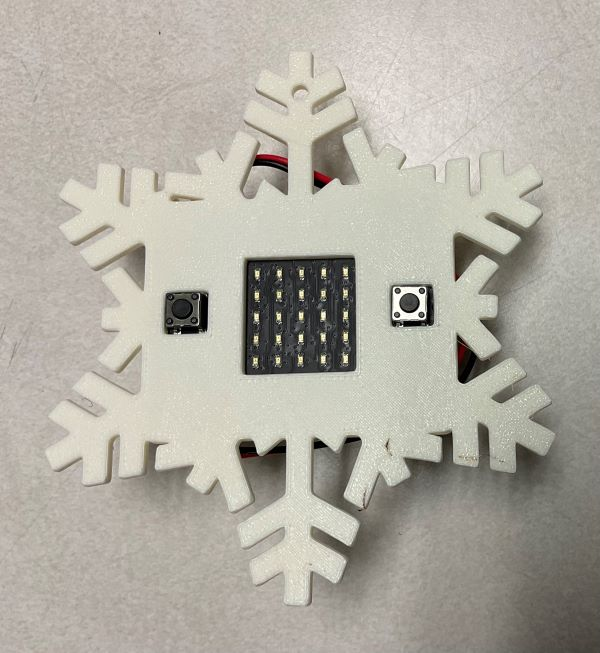
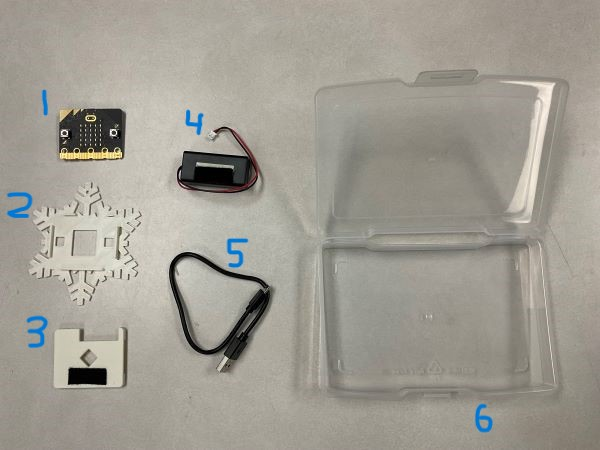
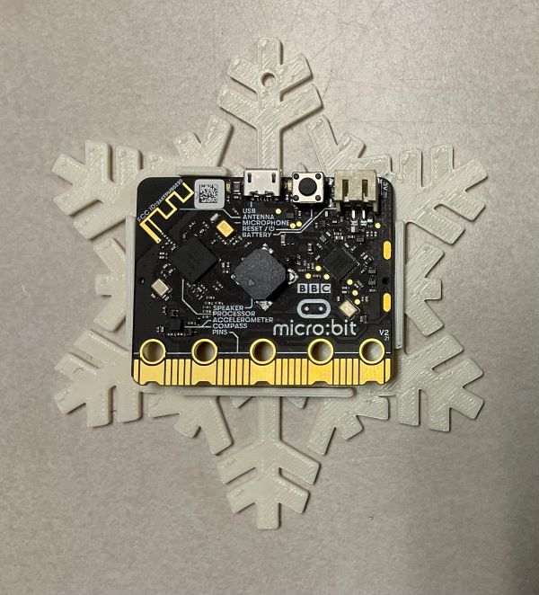
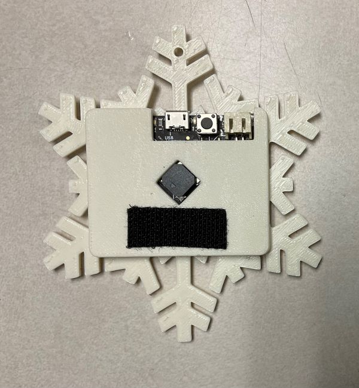
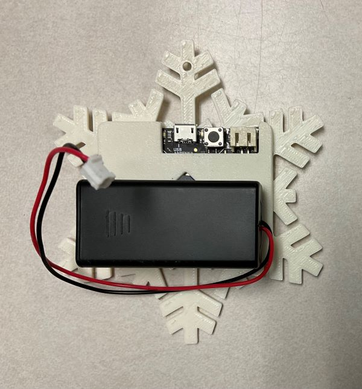
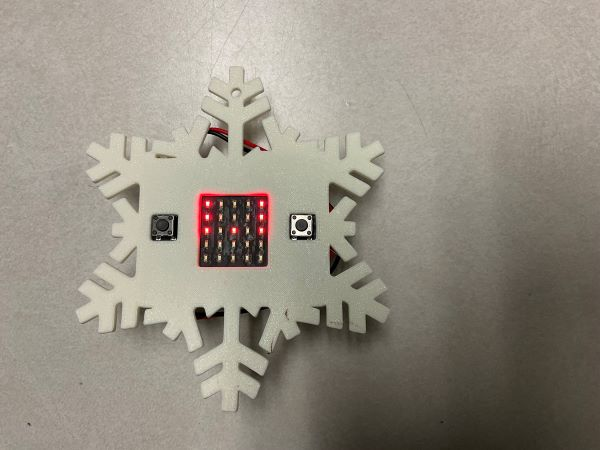

# micro:bit Christmas Decoration

## About the micro:bit

- the full block language MakeCode Editor can be found here: [https://makecode.microbit.org/](https://makecode.microbit.org/)
- you have been provided with the new VER: 2.0 of the BBC micro:bit that has a microphone, speaker and touch capacitive sensor

## About the micro:bit Christmas Decoration

The micro:bit Christmas Decoration comes with the following parts:
1. BBC micro:bit, VER: 2.0
2. 3D printed snowflake front
3. 3D printed snowflake back, with velcro
4. BBC micro:bit battery pack, with velcro
5. USB cable to program micro:bit
6. container

## Assemble the micro:bit Christmas Decoration

1. place micro:bit inside the snowflake front, the hole is the top to hang on tree

2. press on the snowflake back, the cutout goes to the top

3. attach the battery using the velcro

4. connect the battery to the micro:bit, it will only go in 1 way

5. press "A" & "B" and watch the program run

6. turning off
    1. if turning off for a short time, press and hold the "reset" button on the back for 5 seconds
        1. press the reset button again to turn back on
    2. if storing for a long time, disconnect the battery cable from the micro:bit

## Reuse the micro:bit Christmas Decoration

The micro:bit Christmas Decoration is not to be used **JUST** as a decoration. The micro:bit is intended to be removed and used to continue to learn more about coding. Many more lessons can be found here: [https://microbit.org/teach/lessons/](https://microbit.org/teach/lessons/)

## Lessons we worked through in class

We worked through [this Hapara Workspace](https://bit.ly/3ELBImL) to learn how to use the micro:bit.

Here where the lessons:

- [Lesson #1](https://makecode.microbit.org/#tutorial:github:mr-coxall/microbit-christmas-decoration/lesson-01&lockedEditor=1)
  - [Lesson #1 - Extra](https://makecode.microbit.org/#tutorial:github:mr-coxall/microbit-christmas-decoration/lesson-01-extra&lockedEditor=1)
- [Lesson #2](https://makecode.microbit.org/#tutorial:github:mr-coxall/microbit-christmas-decoration/lesson-02&lockedEditor=1)
  - [Lesson #2 - Extra](https://makecode.microbit.org/#tutorial:github:mr-coxall/microbit-christmas-decoration/lesson-02-extra&lockedEditor=1)
- [Lesson #3](https://makecode.microbit.org/#tutorial:github:mr-coxall/microbit-christmas-decoration/lesson-03&lockedEditor=1)
  - [Lesson #3 - Extra](https://makecode.microbit.org/#tutorial:github:mr-coxall/microbit-christmas-decoration/lesson-03-extra&lockedEditor=1)
- [Lesson #4](https://makecode.microbit.org/#tutorial:github:mr-coxall/microbit-christmas-decoration/lesson-04&lockedEditor=1)

### Tinkercad Design

Here is the link to the Tinkercad design for the snowflake: [https://www.tinkercad.com/things/5dpovJszcTf-microbit-snowflack-case-v20/edit?sharecode=SfmSijLVAsZthSbKHzllhNOk0dBGGyuq_4UVjJuKst8](https://www.tinkercad.com/things/5dpovJszcTf-microbit-snowflack-case-v20/edit?sharecode=SfmSijLVAsZthSbKHzllhNOk0dBGGyuq_4UVjJuKst8)

### STL files

Here are the STL files for the snowflake parts:
- [front](./STL/Micro_Bit%20snowflack%20front%20V2.0.stl)
- [back](./STL/Micro_Bit%20snowflack%20back%20V2.0.stl)

#### Metadata (used for search, rendering)

* for PXT/microbit

